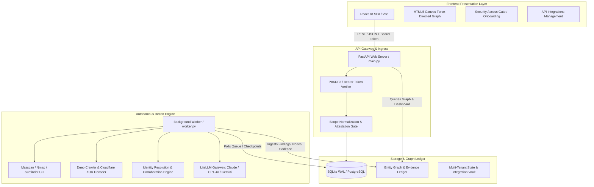

# Recon7: Platform Architecture & Technical Deep-Dive

This document provides a comprehensive technical breakdown of **Recon7**, an autonomous reconnaissance and attack-surface mapping platform engineered for authorized red team operations, penetration testers, and threat intelligence analysts.

---

## 1. High-Level Architectural Blueprint

Recon7 is structured as a decoupled, multi-tiered platform designed for high-concurrency OSINT ingestion, deterministic network telemetry, graph-based entity correlation, and probabilistic AI triage.



---

## 2. Technology Stack & Dependencies

### Backend Ecosystem (Python 3.10+)
* **[FastAPI](https://fastapi.tiangolo.com/) (`>=0.110.0`) & [Uvicorn](https://www.uvicorn.org/) (`>=0.28.0`):** High-performance asynchronous ASGI web framework providing OpenAPI specifications, routing, and non-blocking I/O.
* **[Pydantic v2](https://docs.pydantic.dev/) (`>=2.6.0`):** Ultra-fast data parsing, schema validation, and serialization with compiled Rust core.
* **[SQLAlchemy 2.0](https://www.sqlalchemy.org/) (`>=2.0.28`):** Enterprise ORM and Data Access Layer (DAL) operating in SQLite WAL mode for local installs and ready for PostgreSQL pooling via `psycopg2-binary`.
* **[LiteLLM](https://github.com/BerriAI/litellm) (`>=1.34.0`):** Universal multi-model AI proxy that interfaces seamlessly with Anthropic Claude 3.5 Sonnet, OpenAI GPT-4o, Google Gemini 1.5/2.0, DeepSeek-V3, and local Ollama instances using standardized OpenAI-compatible payloads.
* **[HTTPX](https://www.python-httpx.org/) (`>=0.27.0`):** Fully async and sync HTTP client with HTTP/2 support, SSL context customization, and connection pooling.
* **[DNSPython](https://www.dnspython.org/) (`>=2.6.1`):** Direct low-level DNS resolver used for authoritative name server queries, SPF/DMARC record extraction, MX resolution, and zone transfer audits.
* **[BeautifulSoup4](https://www.crummy.com/software/BeautifulSoup/) (`>=4.12.3`):** HTML/XML DOM parser for extracting JSON-LD Schema.org entities, OpenGraph tags, corporate emails, and leadership profiles.
* **[PyPDF](https://pypdf.readthedocs.io/) (`>=4.1.0`):** Document binary parser for metadata extraction (author names, internal domain usernames, creator software).
* **[tldextract](https://github.com/john-kurkowski/tldextract) (`>=5.1.0`):** Accurate Public Suffix List (PSL) parsing for separating domain roots, subdomains, and multi-part gTLDs/ccTLDs (`.co.uk`, `.com.au`, etc.).

### Frontend Ecosystem
* **[React 18](https://react.dev/):** Component-driven interface utilizing concurrent rendering and hooks.
* **[Vite 5](https://vitejs.dev/):** Lightning-fast ESM build tool and development server with Hot Module Replacement (HMR).
* **[TailwindCSS 3.4](https://tailwindcss.com/):** Utility-first styling configured with an agency-grade custom DEFCON palette (`#020408` pitch-black background, `cyan-signal`, `magenta-alert`, `success-green`, `amber-400`).
* **[TanStack Query v5 (React Query)](https://tanstack.com/query):** Declarative async state management with automatic background refetching, cache invalidation, and polling.
* **Custom HTML5 Canvas Force-Directed Engine:** Zero-dependency, 60fps graph simulation supporting zoom, pan, node dragging, cluster coloring, and evidence-link inspection.
* **[Lucide Icons](https://lucide.dev/):** Clean, consistent SVG icon system.

---

## 3. Cryptographic Security & Authentication Subsystem

Recon7 is designed for deployment on public enterprise servers, requiring defense-grade access control:

```
[ Incoming Request ]
         │
         ▼
[ Header Verification: Authorization: Bearer <Token> ]
         │
         ├──► Token Missing/Invalid ──► Fallback to X-Tenant-ID (Dev Mode) or HTTP 401
         │
         ▼
[ Cryptographic HMAC-SHA256 Token Signature Validation ]
         │
         ├──► Constant-Time Comparison (hmac.compare_digest)
         ├──► Timestamp Expiry Check (exp < time.time())
         │
         ▼
[ User & Tenant Resolution ]
         │
         ▼
[ Scope Authorization Gate (core/scope.py) ]
         │
         ├──► Normalize Domain (RFC 1035 / IPv4 regex)
         ├──► Query authorized_scopes Table for Tenant ID
         ▼
[ Pipeline Execution Permitted ]
```

### Password Hashing Algorithm
* **Algorithm:** PBKDF2-HMAC-SHA256
* **Iteration Count:** `600,000` rounds (conforming to NIST SP 800-63B and OWASP standards).
* **Salt Generation:** `32` bytes of cryptographically secure pseudorandom numbers (`secrets.token_bytes(32)`).
* **Storage Format:** `pbkdf2_sha256$600000$<salt_hex>$<key_hex>`
* **Verification:** `hmac.compare_digest(calculated_hash, stored_hash)` to eliminate side-channel timing attack vectors.

### Stateless Signed Session Tokens
* Tokens are structured as three base64url-encoded parts: `header.payload.signature`.
* **Header:** `{"alg": "HS256", "typ": "JWT"}`
* **Payload:** `{"sub": "<user_id>", "tenant_id": "<tenant_id>", "email": "<email>", "role": "<role>", "iat": <int>, "exp": <int>}`
* **Signature:** `HMAC-SHA256(secret_key, f"{header_b64}.{payload_b64}")`

---

## 4. The 10-Step Autonomous Pipeline Engine

The engine ([worker.py](file:///c:/Users/John/Documents/Recon7/worker.py)) operates as an asynchronous daemon executing sequential, checkpointed recon tasks:

| Step | Module | Function & Under-the-Hood Mechanics |
| :--- | :--- | :--- |
| **01. Company Profile & Zone Authority** | `recon/company_resolve.py` | Resolves WHOIS records, registrar identity, DNS nameservers, MX mail hosts, SPF policies, and ASN CIDR routing blocks. Registers root Organization and Domain entities in the Graph. |
| **02. Subdomain Enumeration** | `recon/subdomains.py` | Multi-source passive and active enumeration: Certificate Transparency (crt.sh, TLS SAN), Sublist3r passive sources, and Subfinder subprocess integration. Normalizes and registers all FQDNs. |
| **03. IP Resolution & CDN Origin Bypass** | `recon/ip_resolve.py` & `recon/origin_extractor.py` | Resolves A/AAAA records for all subdomains. Inspects IP ranges against Anycast CDN databases (Cloudflare, CloudFront, Fastly, Akamai). Probes historical DNS and SSL certificate SANs to isolate direct origin server IPs. |
| **04. Port Sweeping & Service Fingerprinting** | `recon/ports.py` | Asset-weighted 2-stage scanning. First performs an ultra-fast SYN sweep across priority IPs (Masscan / socket sweeps), followed by deep service version probes (Nmap XML dissection) across identified open ports. |
| **05. Web Technology Fingerprinting** | `recon/fingerprint.py` & `recon/technology_engine.py` | Inspects HTTP response headers (`Server`, `X-Powered-By`, `Set-Cookie`), HTML DOM markers, and JavaScript signatures using Wappalyzer JSON signature libraries to detect frameworks, CMSs, web servers, and TLS cipher suites. |
| **06. Vulnerability & Misconfiguration Audit** | `vuln/nuclei_match.py` & `vuln/vulnerability_engine.py` | Executes passive and safe active vulnerability checks (Nuclei templates, CORS misconfigurations, open directory listings, security header absences, exposed `.git` / `.env` files). |
| **07. CVE & OWASP Correlation** | `vuln/cve_lookup.py` | Matches fingerprinted software products and version numbers against the National Vulnerability Database (NVD) and OWASP Top 10 taxonomies. Assigns CVSS severity ratings (Critical, High, Medium, Low, Info). |
| **08. People OSINT & Email Harvesting** | `people/aggregate.py` & `people/site_crawler.py` | Crawls target web pages (about, team, leadership), parses Schema.org JSON-LD, extracts and cleans public executive names, executes search engine dorks, parses PDF/DOCX metadata, and infers corporate email syntax patterns. |
| **09. AI Intelligence Triage** | `ai/triage.py` & `ai/gateway.py` | Sends extracted findings to the LiteLLM AI Gateway (Claude 3.5 Sonnet / GPT-4o / Gemini). The AI validates findings, weeds out false positives, adjusts severity based on asset context, and identifies attack chains. |
| **10. AI Report Synthesis** | `ai/report_writer.py` | Compiles full-scope executive briefing, technical vulnerability ledger, attack surface narrative, prioritized remediation roadmaps, and JSON exports. |

---

## 5. Sanitization, Cleansing & Normalization Subsystems

### A. Cloudflare Email XOR De-Obfuscation
Cloudflare protects email addresses in HTML with an obfuscated span: `<a href="/cdn-cgi/l/email-protection#<hex_string>">`.
* **Cleansing Logic:**
  ```python
  def decode_cloudflare_email(cf_hex: str) -> str:
      key = int(cf_hex[:2], 16)
      email = "".join([chr(int(cf_hex[i:i + 2], 16) ^ key) for i in range(2, len(cf_hex), 2)])
      return email.strip().lower()
  ```

### B. Corporate Noise & Name Cleansing
Web crawlers often pick up UI button labels, privacy headers, and legal disclaimers as candidate employee names. Recon7 filters these through a strict heuristic pipeline:
* **Exclusion Dictionary:** Blocks strings matching terms like `"Terms of Service"`, `"Privacy Policy"`, `"All Rights Reserved"`, `"Cookie Settings"`, `"Sales Department"`, `"Press Release"`.
* **Linguistic Validation:** Rejects strings with digits, special characters, URLs, or more than 4 name tokens.
* **Capitalization & Honorific Normalization:** Cleans prefixes (`Dr.`, `Mr.`, `Ms.`, `Eng.`) and normalizes title casing.

### C. Email Pattern Inference Engine
Recon7 analyzes all discovered verified email addresses for a domain to determine the organization's standardized email naming convention:
* Identifies formats: `{first}.{last}@domain.com`, `{f}{last}@domain.com`, `{first}_{last}@domain.com`, `{first}@domain.com`.
* Uses the discovered pattern to synthesize and verify candidate email addresses for all identified executives and personnel.

---

## 6. Entity-Intelligence Graph & Immutable Evidence Ledger

All intelligence gathered during a scan is stored as a normalized relational graph backed by an immutable audit trail:

```
[ Physical Observation / Tool Output ]
         │
         ▼
[ Evidence Ledger (evidence table) ]
   ├── SHA-256 Checksum Hash
   ├── Provenance: Collector Name & Version
   ├── Observed Timestamp & Raw Reference Payload
   └── Reliability Score (0.0 - 1.0)
         │
         ▼
[ Entity Graph Nodes (entities table) ]
   ├── Types: domain, subdomain, ip_address, port, service, vulnerability, person, email, document
   ├── Properties JSON
   └── Corroborated Confidence Score (0.0 - 1.0)
         │
         ▼
[ Entity Relationships (entity_relationships table) ]
   ├── Predicates: RESOLVES_TO, RUNS_SERVICE, HAS_VULNERABILITY, EMPLOYED_BY, AUTHORED_BY
   └── Supporting Evidence Foreign Keys
```

### Mathematical Confidence Calculation
Confidence scores ($C$) are computed dynamically using multi-source corroboration and contradiction penalties:
$$C = 1.0 - \prod_{i=1}^{n} (1.0 - w_i) - P_{contradiction}$$
Where $w_i$ represents the collector reliability weight (e.g., DNS Direct Probe = 0.95, Search Dork = 0.45), ensuring that multi-source corroborated findings rise to the top while unconfirmed signals remain flagged.

---

## 7. Current State, Bottlenecks & Future Roadmap

### Current Operational State
* **Local & Server Readiness:** Fully functional multi-tenant red team platform with SQLite/WAL concurrency, FastAPI backend, Vite/React dark-mode console, and background task worker.
* **Test Coverage:** Automated test suite (`pytest`) covering authentication, cryptosystems, scope gating, parsers, and API contracts.

### Architectural Bottlenecks & Mitigations

```
┌───────────────────────────────────────┬────────────────────────────────────────────────────────┐
│ Current Bottleneck                    │ Technical Mitigation / Future State Architecture       │
├───────────────────────────────────────┼────────────────────────────────────────────────────────┤
│ SQLite Single-Writer Lock under heavy │ Native PostgreSQL connection pooling via psycopg2      │
│ multi-tenant scan concurrency.        │ and SQLAlchemy async sessions.                         │
├───────────────────────────────────────┼────────────────────────────────────────────────────────┤
│ Subprocess polling via worker.py      │ Distributed Celery / Redis task queue with standalone  │
│ running on a single host.             │ worker container instances.                            │
├───────────────────────────────────────┼────────────────────────────────────────────────────────┤
│ Search Engine API rate limits &       │ Integrated query caching (SearchCache table) +         │
│ query credit exhaustion.              │ rotating proxy pools and fallback search scrapers.     │
├───────────────────────────────────────┼────────────────────────────────────────────────────────┤
│ Large DOM memory footprints during    │ Streaming HTML chunk parser + headless Chromium        │
│ multi-page deep web crawling.         │ browser pool with process recycling.                   │
└───────────────────────────────────────┴────────────────────────────────────────────────────────┘
```

### Future Architectural Roadmap
1. **Distributed Sensor Nodes:** Deploy lightweight remote worker agents in different geographic cloud regions for distributed port scanning and Anycast origin triangulation.
2. **Continuous Attack Surface Monitoring (CASM):** Recurring automated cron-based delta scans with real-time Slack/Discord webhook alerts for newly exposed ports or leaked credentials.
3. **Graph Neural Network (GNN) Attack Pathing:** Automated calculation of optimal lateral movement attack chains from the edge subdomain to internal executive assets.
